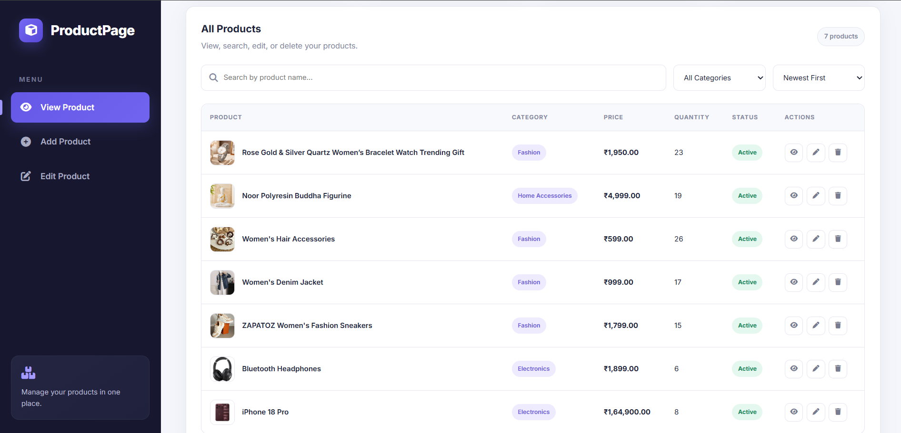
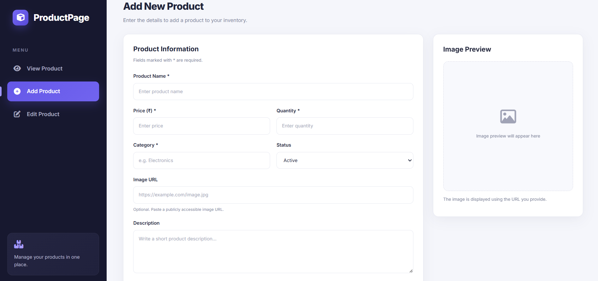
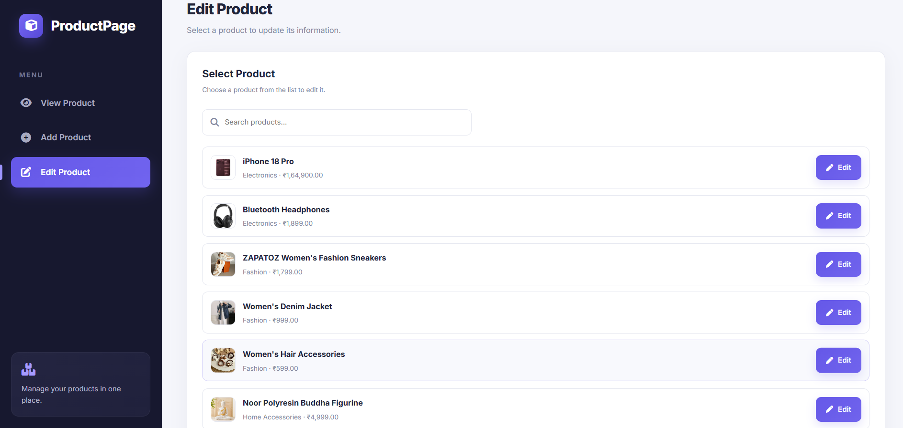

<div align="center">


<br>


### 📦 Modern Product Management Dashboard

A clean, responsive and professional product management system.
<br>


<br>

✨ Features •
🖥️ Screens •
⚡ Workflow •
📁 Structure •
🚀 Installation

</div>

---

# 📌 About The Project

**ProductPage** is a modern product management dashboard designed to provide a simple and organized way to manage inventory.

The application provides separate interfaces for:

- 👁️ Viewing products
- ➕ Adding products
- ✏️ Editing products
- 🗑️ Deleting products
- 🔍 Searching products
- 🏷️ Filtering products
- ↕️ Sorting products
- 🖼️ Previewing product images
- 📊 Managing product information

The interface uses a modern dashboard layout with a dark sidebar, purple accent colors, rounded cards, status badges and responsive layouts.

---

# ✨ Features

<div align="center">

### Powerful product management with a clean, modern experience.

<br>

</div>

<table>
<tr>
<td width="50%" valign="top">

### 📦 Product Management

> Manage your complete product inventory from one place.

<br>

**01 · View Products**  
Browse products with detailed information including price, quantity, category and status.

**02 · Add Products**  
Create new products with a structured and easy-to-use form.

**03 · Edit Products**  
Update product information whenever changes are required.

**04 · Delete Products**  
Remove products from your inventory with a simple action.

</td>

<td width="50%" valign="top">

### 🔎 Search & Discovery

> Find exactly what you need without navigating through unnecessary screens.

<br>

**01 · Smart Search**  
Search products instantly using their names.

**02 · Category Filter**  
Quickly narrow down products by category.

**03 · Sorting**  
Organize products using different sorting options.

**04 · Quick Actions**  
Access view, edit and delete actions directly from the product list.

</td>
</tr>

<tr>
<td width="50%" valign="top">

### 🖼️ Product Visualization

> Keep your inventory visually clear and easy to understand.

<br>

**01 · Product Images**  
Display product images directly inside the product listing.

**02 · Image URL**  
Add product images using an image URL.

**03 · Live Preview**  
Preview the selected image before saving the product.

**04 · Image Fallback**  
Maintain a clean layout even when an image is unavailable.

</td>

<td width="50%" valign="top">

### 🎨 Modern Interface

> Designed to feel like a professional product management dashboard.

<br>

**01 · Clean Layout**  
Organized content with clear visual hierarchy.

**02 · Dark Sidebar**  
Dedicated navigation for quick access to product operations.

**03 · Purple Accent**  
A consistent purple visual identity across interactive elements.

**04 · Responsive Design**  
Optimized for desktop, tablet and mobile devices.

</td>
</tr>
</table>

<br>

<div align="center">

### ⚡ Everything is designed around one simple goal

**Manage products faster. Keep inventory organized.**

<br>

`CREATE` &nbsp; → &nbsp; `READ` &nbsp; → &nbsp; `UPDATE` &nbsp; → &nbsp; `DELETE`

</div>

# 🖥️ Screens
## 1️⃣ View Products
### Preview

<p align="center">

</p>

---
## 2️⃣ Add New Product
### Preview
<p align="center">  </p>

---
## 3️⃣ Edit Product
### Preview
<p align="center">  </p>
---

## 🔄 CRUD Operations

The project follows the basic CRUD product-management concept.
```
       CREATE
         │
         ▼
   ┌─────────────┐
   │ Add Product │
   └──────┬──────┘
          │
          ▼
       READ
          │
          ▼
   ┌─────────────┐
   │View Products│
   └──────┬──────┘
          │
          ▼
      UPDATE
          │
          ▼
   ┌─────────────┐
   │Edit Product │
   └──────┬──────┘
          │
          ▼
      DELETE
          │
          ▼
   ┌─────────────┐
   │Delete Product│
   └─────────────┘
```
---

## 📁 Project Structure
```
ProductPage/
│
├── index.html
│
├── css/
│   └── style.css
│
├── js/
│   └── script.js
│
├── images/
│   ├── view-page.png
│   ├── add-page.png
│   └── edit-page.png
│
└── README.md
```
---

## ## 🛠️ Technologies Used

| Technology | Usage |
|---|---|
| 🌐 **HTML5** | Website structure |
| 🎨 **CSS3** | UI design, styling and responsive layout |
| ⚡ **JavaScript** | Dynamic functionality and interactions |
| ⭐ **Font Awesome** | User-interface icons |
| 🖼️ **Images** | Product images and project screenshots |

---

## 🚀 Getting Started
### 1. Clone the Repository
```
git clone https://github.com/Drash011/ProductPage.git
```
### 2. Open the Project
```
cd ProductPage
```
### 3. Run the Project
Open:
```
index.html
```
Or use VS Code Live Server for a better development experience.
---

<div align="center">

## 📦 ProductPage
Manage Products. Simplify Inventory.
<br> 

 </div>
